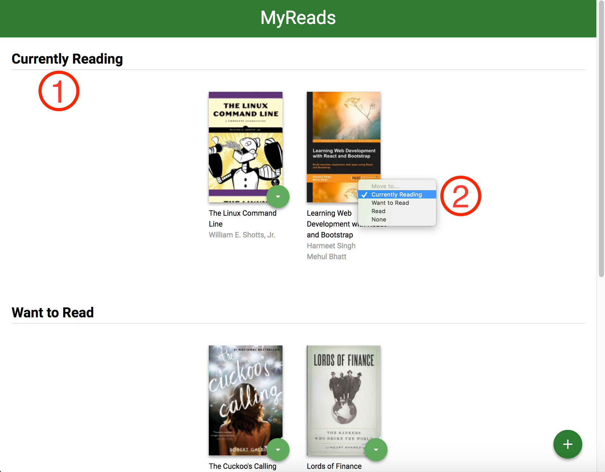
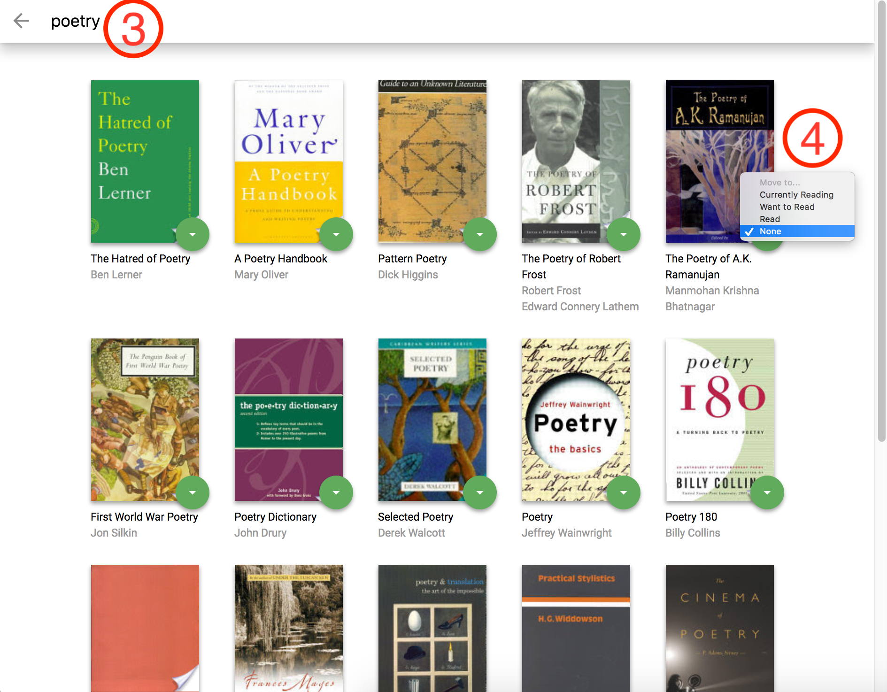

# MyReads Project

MyReads is a bookshelf app that allows you to select and categorize books you have read, are currently reading, or want to read. It allows also to search for new books to be included in the bookshelf. See **Usage** below for more details.

## Installation

Clone the repository and use **yarn (or npm)** to install all project dependencies and to start the application:

```
$ git clone https://github.com/pasquinijr/reactnd-project-myreads-starter.git
$ cd reactnd-project-myreads-starter
$ yarn install
$ yarn start
```

## Usage

### Bookshelf

The bookshelf can be seen in the picture below:

- There are three shelves available (_see bullet number 1_):
   - Currently Reading
   - Want to Read
   - Read

- You can move a book from one shelf to another by select the **green circle** at the bottom right of the book thumbnail. If you select **none**, the book is removed from the bookshelf (_see bullet number 2_).



### Search Page

You can add new books to your bookshelf by going to the **Search Page** (just selec the **green circle** at the bottom right of the screen).

The Search Page can be seen in the picture below:

- You can search for books by title or author typing at least three caracteres in the search field (_see bullet number 3_).

- As in the Bookshelf page, you can select a shelf for any of the books found on the search results by select the **green circle** at the bottom right of the book thumbnail (_see bullet number 4_).



### Important

The backend API uses a fixed set of cached search results and is limited to a particular set of search terms, which can be found in [SEARCH_TERMS.md](SEARCH_TERMS.md). That list of terms are the _only_ terms that will work with the backend, so don't be surprised if your searches for Basket Weaving or Bubble Wrap don't come back with any results.

## Contributing

This project was developed as part of a React course from [Udacity](www.udacity.com). No further development is planned for the future.

For details, check out [CONTRIBUTING.md](CONTRIBUTING.md).
